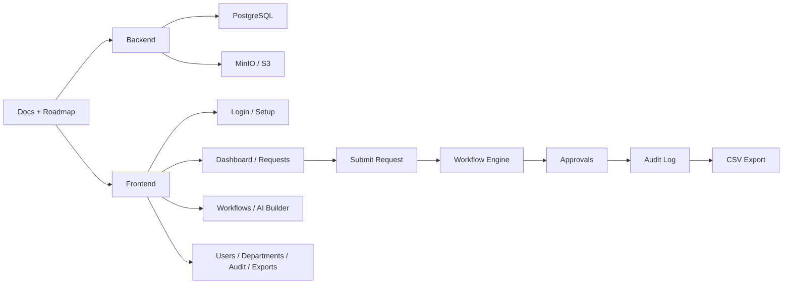

# Operra

Operra is a multi-tenant, self-hosted approval workflow platform.

Version v0.1 focuses on AI-assisted Purchase Request approval.

## Repository Layout

```text
operra/
  CONTRIBUTING.md
  CODE_OF_CONDUCT.md
  CHANGELOG.md
  LICENSE
  SECURITY.md
  SUPPORT.md
  README.md
  .env.example
  apps/
    api/
    web/
  docs/
    roadmap.md
    releases.md
```

## Current Scope

This repository follows the public docs, roadmap, and contributor guidance.

Initial setup targets:

1. Monorepo scaffold for `apps/api` and `apps/web`.
2. Deployment environment variables in `.env.example`.
3. Docker Compose and application implementation in later tasks.

## Reference Docs

Read these in order before implementing features:

1. `docs/prd.md`
2. `docs/architecture.md`
3. `docs/data-model.md`
4. `docs/workflow-engine.md`
5. `docs/api.md`
6. `docs/security.md`
7. `docs/testing.md`

Use `docs/roadmap.md` as the public implementation overview.

Use `CONTRIBUTING.md` for contribution guidelines.

See `CODE_OF_CONDUCT.md` for community standards.

See `LICENSE` for the project license.

See `SECURITY.md` for vulnerability reporting.

See `SUPPORT.md` for help and issue guidance.

See `CHANGELOG.md` for release notes.

See `docs/releases.md` for public release highlights.

Workflow chart:

- `docs/workflow-chart.md`

## Workflow Overview



For the detailed repo and app flow, see `docs/workflow-chart.md`.
