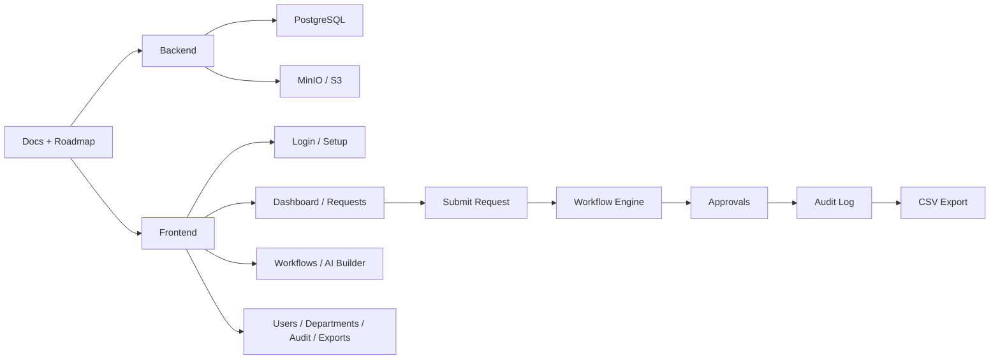

# Operra

Operra is a multi-tenant, self-hosted approval workflow platform for purchase request approvals.

Version v0.1 focuses on AI-assisted Purchase Request approval.

[](LICENSE)
[](CONTRIBUTING.md)
[](SECURITY.md)

## At A Glance

- Multi-tenant from day one
- JSON-first workflow configuration
- AI-assisted workflow generation
- S3-compatible attachments with MinIO for self-hosting
- Audit logs and CSV exports built in
- Next.js frontend with a Go API backend

## Public Docs

| Doc | Purpose |
|---|---|
| [docs/prd.md](docs/prd.md) | Product scope and target users |
| [docs/architecture.md](docs/architecture.md) | System structure and module responsibilities |
| [docs/data-model.md](docs/data-model.md) | Database schema and relationships |
| [docs/workflow-engine.md](docs/workflow-engine.md) | Workflow rules and approval behavior |
| [docs/api.md](docs/api.md) | Backend endpoint contract |
| [docs/ui.md](docs/ui.md) | Frontend screens and UX expectations |
| [docs/security.md](docs/security.md) | Security, tenancy, and permission rules |
| [docs/testing.md](docs/testing.md) | Testing strategy and checks |
| [docs/deployment.md](docs/deployment.md) | Local and self-hosted deployment |
| [docs/roadmap.md](docs/roadmap.md) | Public implementation roadmap |
| [docs/workflow-chart.md](docs/workflow-chart.md) | End-to-end repo and app flow |
| [docs/releases.md](docs/releases.md) | Public release index |

## Getting Started

1. Read the public docs above.
2. Copy `.env.example` to `.env`.
3. Run `docker compose up -d`.
4. Use `docs/deployment.md` if you want the full local or self-hosted setup guide.

## Repository Layout

```text
operra/
  CONTRIBUTING.md
  CODE_OF_CONDUCT.md
  CHANGELOG.md
  LICENSE
  SECURITY.md
  SUPPORT.md
  README.md
  .env.example
  apps/
    api/
    web/
  docs/
    roadmap.md
    releases.md
```

## Workflow Overview



For the detailed repo and app flow, see [docs/workflow-chart.md](docs/workflow-chart.md).

## Open Source

This repository is the public Operra OSS codebase.

It includes:

- Product docs, architecture, API, UI, security, and testing guidance
- A public roadmap and versioned release notes
- Community standards and support policies
- Docker Compose setup for local and self-hosted use

If you want to contribute:

- Read [CONTRIBUTING.md](CONTRIBUTING.md)
- Check [docs/roadmap.md](docs/roadmap.md)
- Open a bug report or feature request using the GitHub templates

If you find a security issue:

- Follow [SECURITY.md](SECURITY.md)
