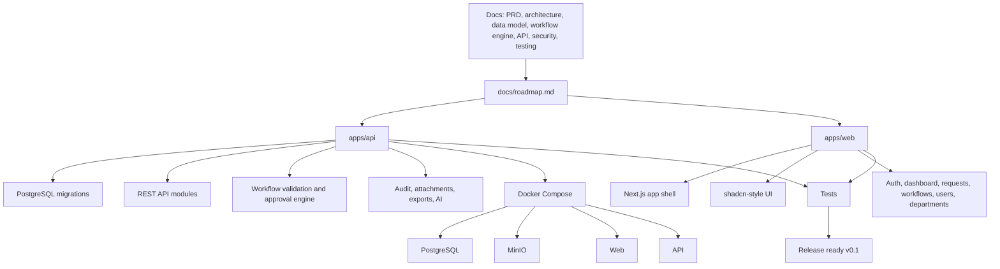
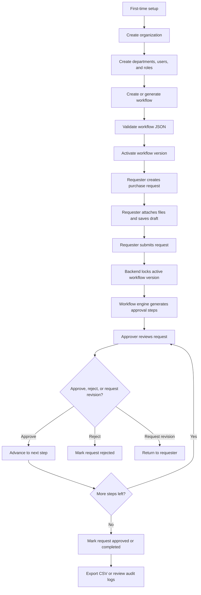
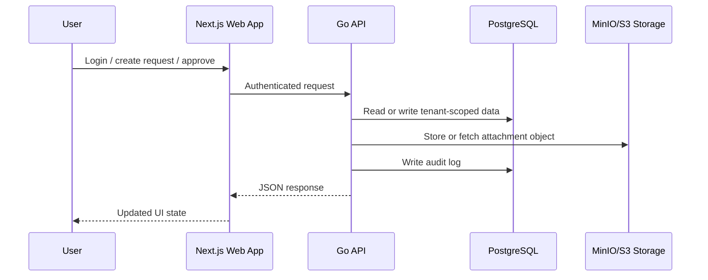

# Operra Workflow Chart

This document shows how the repository is organized and how the app is used end to end.

## Repo Workflow

Operra follows the public roadmap in `docs/roadmap.md`:



What this means:

- Docs define the product, architecture, data model, and constraints.
- The roadmap turns those docs into a public build overview.
- The backend owns tenancy, permissions, workflow execution, and audit rules.
- Attachment downloads are served through authenticated backend checks in v0.1.
- The frontend is a thin operational layer over the API.
- Docker Compose ties the stack together for local and self-hosted use.

## App Usage

This is the main user journey in v0.1:



## Runtime Flow

This is how a request moves through the system:



## Request State Flow

The backend uses the request lifecycle defined in `docs/workflow-engine.md`:

```text
draft -> submitted -> in_review -> approved -> processing -> completed
                   -> revision_requested -> submitted
                   -> rejected
draft -> cancelled
submitted -> cancelled
revision_requested -> cancelled
```

Notes:

- The request stores the workflow version that was active when it was submitted.
- Workflow edits do not rewrite already submitted requests.
- Approvers are resolved by role, organization, and step scope.
- AI can propose workflow JSON, but the backend validates and executes it.

## How To Read The Repo

- Start with `docs/prd.md` for product intent.
- Use `docs/architecture.md` for system shape.
- Use `docs/workflow-engine.md` for approval rules and state transitions.
- Use `docs/api.md` for endpoint contracts.
- Use `docs/ui.md` for the screen list and UX expectations.
- Use `docs/roadmap.md` for the public implementation overview.
