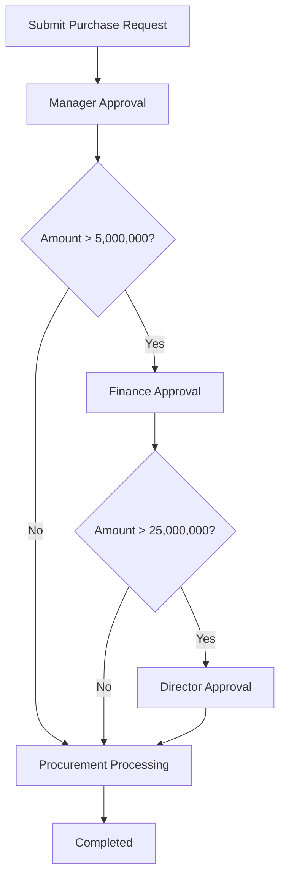

# Operra Workflow Engine

## 1. Purpose

The workflow engine is the core of Operra.

It must execute approval workflows deterministically based on JSON configuration.

AI can generate workflow config, but the engine must validate and execute the workflow. The engine is the authority, not the AI model.

## 2. Core concepts

### Workflow

A logical workflow, such as `Purchase Request Approval`.

### Workflow version

An immutable JSON configuration of a workflow.

Requests store the workflow version used at submission time.

### Workflow step

A configured approval or processing step.

### Approval step instance

A runtime instance of a workflow step attached to a specific request.

### Approval action

An action taken by an approver: approve, reject, request revision, or process.

## 3. Workflow config schema

Initial v0.1 config shape:

```json
{
  "name": "Purchase Request Approval",
  "type": "purchase_request",
  "version": 1,
  "steps": [
    {
      "key": "manager_approval",
      "name": "Manager Approval",
      "approver_role": "manager",
      "scope": "requester_department",
      "required": true
    }
  ]
}
```

## 4. Step fields

| Field | Type | Required | Notes |
|---|---|---|---|
| key | string | yes | Unique within workflow version |
| name | string | yes | Human readable name |
| approver_role | string | yes | Role required to act on the step |
| scope | string | yes | `organization` or `requester_department` |
| required | boolean | yes | v0.1 should treat all steps as required if included |
| condition | object | no | Condition to determine if step applies |

## 5. Supported scopes

### organization

Any user with the required role in the same organization can act.

### requester_department

Only users with the required role in the requester's department can act.

## 6. Supported condition operators

v0.1 supports simple conditions only.

| Operator | Meaning |
|---|---|
| `>` | Greater than |
| `>=` | Greater than or equal |
| `<` | Less than |
| `<=` | Less than or equal |
| `==` | Equal |
| `!=` | Not equal |

Supported fields for Purchase Request conditions:

```text
estimated_amount
currency
urgency
department_id
```

Do not implement nested boolean logic in v0.1 unless necessary.

## 7. Default purchase request workflow

```json
{
  "name": "Purchase Request Approval",
  "type": "purchase_request",
  "version": 1,
  "steps": [
    {
      "key": "manager_approval",
      "name": "Manager Approval",
      "approver_role": "manager",
      "scope": "requester_department",
      "required": true
    },
    {
      "key": "finance_approval",
      "name": "Finance Approval",
      "approver_role": "finance",
      "scope": "organization",
      "required": true,
      "condition": {
        "field": "estimated_amount",
        "operator": ">",
        "value": 5000000
      }
    },
    {
      "key": "director_approval",
      "name": "Director Approval",
      "approver_role": "director",
      "scope": "organization",
      "required": true,
      "condition": {
        "field": "estimated_amount",
        "operator": ">",
        "value": 25000000
      }
    },
    {
      "key": "procurement_processing",
      "name": "Procurement Processing",
      "approver_role": "procurement",
      "scope": "organization",
      "required": true
    }
  ]
}
```

## 8. Request state machine

Request statuses:

```text
draft
submitted
in_review
revision_requested
approved
rejected
processing
completed
cancelled
```

### Allowed transitions

```text
draft -> submitted
submitted -> in_review
in_review -> revision_requested
revision_requested -> submitted
in_review -> approved
in_review -> rejected
approved -> processing
processing -> completed
submitted -> cancelled
revision_requested -> cancelled
draft -> cancelled
```

Notes:

- A request can be cancelled by requester while it is draft, submitted, or revision_requested.
- A request cannot be cancelled after it is approved unless future business rules allow it.
- Rejected is terminal in v0.1.
- Completed is terminal in v0.1.

## 9. Approval step statuses

```text
pending
approved
rejected
revision_requested
skipped
not_applicable
```

### Step generation

When a request is submitted:

1. Fetch active workflow version.
2. Evaluate each step condition against request data.
3. Create approval step instances for applicable steps.
4. Mark non-applicable steps as `not_applicable` only if you need visibility. Otherwise omit them.
5. Set the first applicable step to `pending`.
6. Set request status to `in_review`.

Simpler v0.1 approach:

- Only create applicable steps.
- Keep sequence number.
- First step is pending.
- Other steps can be `pending` but not actionable until previous steps complete, or `waiting` if you add a waiting status.

Recommended statuses for instances:

```text
waiting
pending
approved
rejected
revision_requested
skipped
```

## 10. Approver resolution

To determine whether a user can act on a step:

1. User organization must match request organization.
2. User must have the step's `approver_role`.
3. If step scope is `requester_department`, user department must match requester's department or request department.
4. User cannot approve their own request in v0.1.
5. Request must be at the current actionable step.

## 11. Approval actions

### Approve

Preconditions:

- Request status is `in_review` or `processing` where appropriate.
- Current step is pending.
- User is valid approver.

Effects:

- Create approval action.
- Mark current step approved.
- Add audit log `request.approved` or `approval.approved`.
- Advance to next step.
- If no steps remain, mark request approved.

### Reject

Preconditions:

- Current step is pending.
- User is valid approver.
- Comment should be required.

Effects:

- Create approval action.
- Mark current step rejected.
- Mark request rejected.
- Add audit log `request.rejected`.

### Request revision

Preconditions:

- Current step is pending.
- User is valid approver.
- Comment should be required.

Effects:

- Create approval action.
- Mark current step revision_requested.
- Mark request revision_requested.
- Add audit log `request.revision_requested`.

### Resubmit after revision

Preconditions:

- Request status is `revision_requested`.
- Requester edits request.
- Requester resubmits.

Effects:

- Add audit log for update and resubmit.
- Engine may reset approval steps from the beginning in v0.1.

Simpler v0.1 rule:

> Revision resubmission restarts approval from step 1.

## 12. Procurement processing step

In v0.1, procurement processing can be modeled as a workflow step assigned to role `procurement`.

Action can be `approve` or a specific `mark_processed` endpoint.

Recommended for v0.1:

- Use normal approve action for procurement step.
- When procurement step is approved, request becomes `completed`.

## 13. Workflow validation rules

Backend must validate workflow JSON before saving.

Validation rules:

- `name` is required.
- `type` must be `purchase_request` in v0.1.
- `steps` must have at least one step.
- Step keys must be unique.
- Step keys must be slug-like.
- Step names are required.
- `approver_role` must exist or be one of built-in roles.
- `scope` must be supported.
- Conditions must use supported fields and operators.
- Condition values must match expected field type.
- Workflow must produce at least one applicable step for common request examples.

## 14. Mermaid diagram generation

Generate a Mermaid flowchart from workflow config.

Example:



For v0.1, a simpler linear diagram with condition labels is acceptable.

## 15. AI-generated workflows

AI generated config must follow the same validation as manually written config.

AI endpoint should return:

```json
{
  "workflow_json": {},
  "explanation": "...",
  "mermaid": "flowchart TD ...",
  "warnings": []
}
```

Backend must:

- Parse output safely.
- Validate JSON.
- Return validation errors if invalid.
- Require admin confirmation before saving.

## 16. Audit requirements

Workflow engine actions must create audit logs:

- Workflow created.
- Workflow version created.
- Workflow version activated.
- Request submitted.
- Step approved.
- Step rejected.
- Revision requested.
- Request completed.

## 17. Test cases

Minimum workflow tests:

1. Request amount 1,000,000 creates manager + procurement steps.
2. Request amount 10,000,000 creates manager + finance + procurement steps.
3. Request amount 30,000,000 creates manager + finance + director + procurement steps.
4. User without role cannot approve.
5. User from wrong organization cannot approve.
6. Requester cannot approve own request.
7. Workflow version remains locked after submission.
8. Reject marks request as rejected.
9. Request revision restarts approval after resubmission.
10. Every action creates audit log.
